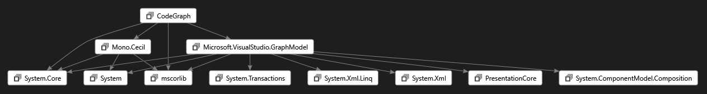
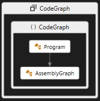

# CodeGraph

This is a simple .NET command line tool that uses Mono.Cecil to extract code dependencies
generating DGML diagrams covering the requested level of details.

**Usage:** CodeGraph [options] filename.dgml

Generates various DGML diagrams from given input assemblies:

Options:
```
   -i  assemblypath
   -a  add assembly dependency graph
   -n  add namespace dependency graph
   -t  add type dependency graph
   -m  add method level dependencies
   -f  field level dependencies
   -p  add private member info
```

For example, this command line:

```
CodeGraph -a -i CodeGraph.exe test.dgml
```

Produces this assembly dependency diagram:



Whereas if you want to see the public types organized by namespace do this:

```
CodeGraph.exe -n -t -p -i  CodeGraph.exe test.dgml
```



